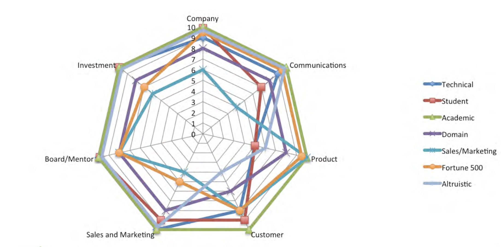

My main takeaway from this article was that I need to learn proper and directed self-reflection in order to start a successful business. Successful entrepreneurs reflect not only on their products but on themselves. Lack of knowledge and planning are the two greatest enemies of an entrepreneur – mostly entirely unrelated to the actual product. Most of the common mistakes seem to be underestimating the amount of pre-work necessary to properly complete a task.
Additionally, Ted talks about the different types of founders, and I found the above chart very interesting. It describes the types of errors each type of founder is most likely to make where 10 is very likely and 0 is unlikely. I didn’t expect that student founders are the most unlikely to commit a product error. I thought that was the hardest part, and I’d imagine that Sales/Marketing founders would be much more adept at that sort of thing. However, I suppose since students are usually in the field they are creating for, they tend to have a deeper understanding of the problem they are solving. That would explain why technical founders also seem to be as unlikely as students to commit product errors. All of the other categories followed what I would expect, but this visualization was very interesting. 

