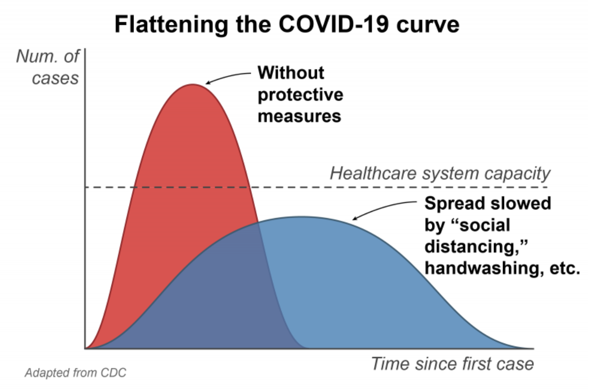
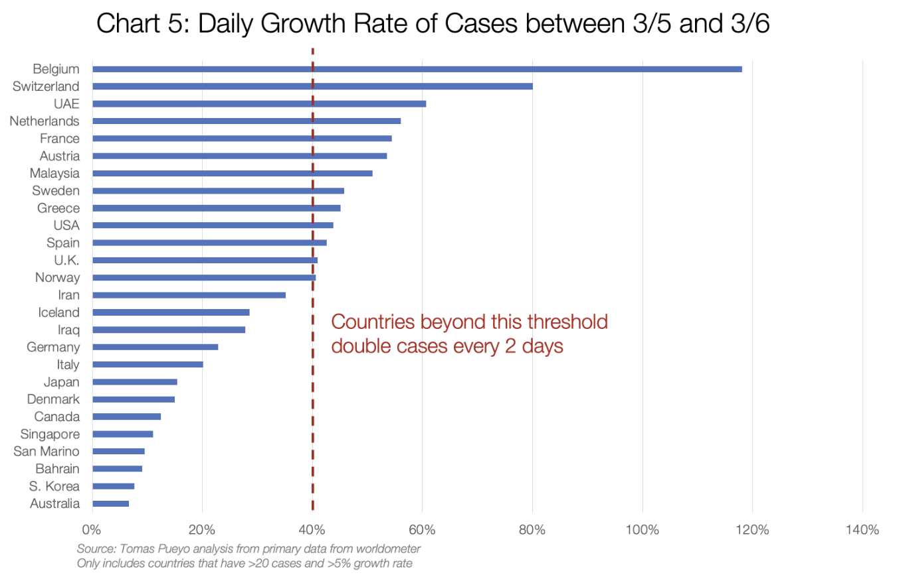
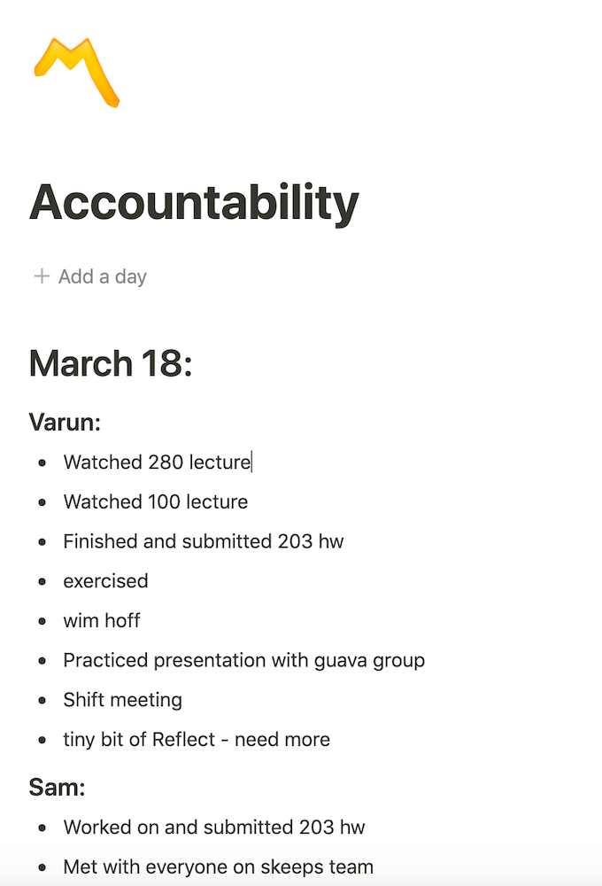

&nbsp;&nbsp;&nbsp;&nbsp;Source: r/udub (u/shdujfbdg)

##Contents
* __Wow this is Crazy__: My initial thoughts on Covid-19  
* __Social Distancing__: The importance of social distancing  
* __Productivity__: Things I am trying in order to stay productive in these unusual times  
* __Links__: Some links to cool articles

##Wow this is Crazy
Coronavirus will go down in history as one of the great pandemics of the ages. I've never seen anything like this in my life. I feel like I am reading the headlines straight out of Plague Inc. (Fun fact: after coronavirus started, Plague Inc. soared to the #1 paid app on the app store in China.) Ironic: yes. Morbid: also yes. 

However, on a more serious note, I understand that I am extremely privileged when I say that this virus will not affect me as much as it will affect others. I am safe in my home with my family with plenty of food. Sure, I have to take online classes instead of being back in college at University of Michigan, but that is a minor inconvenience. This virus will hit the homeless hardest. Not only will they be unsheltered, lay offs are skyrocketing. Additionally, many Americans who live paycheck to paycheck are struggling a ton. I was really happy to hear that my high school and other schools have continued to serve food to those who depend on school lunch. 

##Social Distancing
Everyone seems to suggest social distancing, why? At first I thought it was simply to protect people from coronavirus. Social distancing is not to avoid getting infected. It is to avoid everyone getting infected _at the same time_. You may have heard the phrase flattening the curve by now. This graphic explains what that means.

&nbsp;&nbsp;&nbsp;&nbsp;Source: Yellowstone Public Radio

If we don't socially distance ourselves, then everyone will be infected at the same time and our healthcare system will be overloaded. This will cause many people to go untreated and therefore many more deaths. The death rate can be lowered if people get infected more gradually so everyone is able to get the care they need. This doesn't mean that everyone must get coronavirus. Once a vaccine is created, people can avoid getting the disease entirely. 

Unfortunately, Italy is one of the countries that has already reached the point of healthcare system overload. Healthcare workers are being severely overworked, leading to lack of sleep which compromises their immune systems. On top of that the shortage of protective gear like face masks and aprons means that many of these healthcare workers are in the same protective gear for hours upon hours. All of these factors combined means that the workers begin to get sick and the cycle repeats. This is what social distancing hopes to avoid. 

The United States is close behind Italy. The following graph shows the growth rate as it was in early March. We are doubling in cases every 2 days. 

&nbsp;&nbsp;&nbsp;&nbsp;Source: Tomas Pueyo

If we continue as we are, estimates say we are 9-10 days behind Italy. What can we do? Socially distance. Scientists are currently working hard to create a vaccine. We will all be fine, but we must be careful for the sake of our medical workers. 

##Productivity
For many college students like myself around the world, the Coronavirus has caused our colleges to go entirely online and has forced everyone to go home. This means that many students must sustain regular college work loads in a place that is commonly associated with breaks from school. It took me a few days to adjust. You could say my productivity cratered almost as much as SPY. At first my brain simply could not accept that I should continue doing college work at home. My first two days at home involved almost everything but schoolwork (including a lot of Minecraft), but I soon understood that I was going to fall behind. I hid my mouse (Minecraft without a mouse is not as enjoyable) and began to focus myself. 

I narrowed down my productivity decrease to a lack of accountability. In college, I am constantly surrounded by people doing incredible things and being extremely efficient. Seeing my classmates be efficient on a daily basis motivates me to be efficient as well. The problem with isolation is that it lacks people. This means that the energy that we get from talking to excited people or the inspiration we get from seeing the cool things people do is completely gone. Our role models feel removed. 

What am I doing to solve this? I am currently trying out an accountability document (in [Notion](https://www.notion.so/desktop)).

Every day I put down a record of what I did that day. I have added a couple of my friends to the document. The document allows me to reflect on what I did that day and whether I felt productive that day. Since my friends are also on the document, I can also get inspired by what they do every day. 

If this continues to work, I am considering making a social network where you report your day ([inspiration](https://wip.chat/)). Or perhaps a chrome extension where the new tab page includes a way to report your day along with a report of your past days.

I also have been very consistent in journaling and in time blocking my day (see Cal Newport's Time Blocking Strategy in Links). 

I wish you a fun and productive isolated time.

##Links
<https://medium.com/@tomaspueyo/coronavirus-act-today-or-people-will-die-f4d3d9cd99ca>  
<https://blog.rohitbommisetti.com/2020/03/12/access-main-program-access-main-security-access-main-program-grid/>  
Two super informative pieces about the growth of Coronavirus and the implications

<https://www.calnewport.com/blog/2013/12/21/deep-habits-the-importance-of-planning-every-minute-of-your-work-day/>  
Cal Newport's Time Blocking Strategy

<https://coronavirus.jhu.edu/map.html/>
Data on how the virus is progressing (added 3/27/2020)

