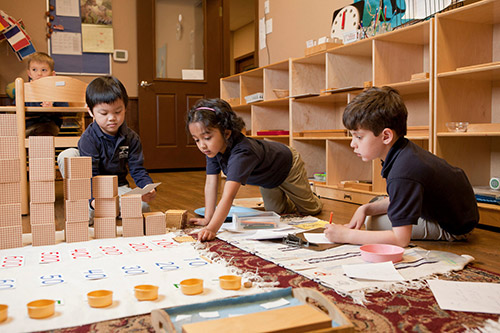

The Montessori method of education was created by Italian physician [Maria Montessori]([https://en.wikipedia.org/wiki/Maria_Montessori](https://en.wikipedia.org/wiki/Maria_Montessori)) based on her scientific observations of children. It focuses on giving children the opportunity to explore on their own using specially designed objects and project based learning. 

I believe that education has a long way to go in terms of reform. I think the current methods that kids use to learn is outdated and inefficient. So, when I first heard of Montessori education, I was enamored. That sounds like the best way to learn. You learn by *doing*. Every kid is given the opportunity to go at their own pace and learn how they want to learn along with the guidance of the teacher. They have the opportunity to develop interest in the things they are doing by exploring on their own. 

Also, the teacher's job drastically changes. Rather than being completely focused on teaching, the teacher becomes the facilitator. The teacher can be much more focused on developing their students' soft skills like working in groups and socializing.

# Education in an Age Range

One of the most interesting parts of Montessori education is that students are put together with students in an age range. Students are not separated by grade. At first this seems very unintuitive, but this allows students to act as leaders and teachers for younger children, and also allows them to be enriched by interacting with older kids as well. Everyone is given the opportunity to be on both sides, helping develop soft skills. 

Being educated with people younger than you currently has a stigma. I've always felt a sense of superiority when I was the eldest at my school (middle or high). This is certainly natural, but it is not optimal for learning nor is it a good attitude to have. I definitely could have learned a lot more from those younger than me if I had been more open to it. 

I was closed off from learning from those younger than me because I was simply older and "more learned." That was largely on me, however I think there is some institutional influence since it is a fairly common sentiment. Since we have been separated by grade level since we were kids, we were trained to believe that intelligence was correlated with age. Since we were only trained to be learners — not mentors or teachers — we did not understand the value of learning from those younger than us.

# Why Aren't They Widely Implemented?

So if Montessori schools are so appealing, why haven't they been widely [implemented](https://amshq.org/About-Montessori/Inside-the-Montessori-Classroom)? It is incredibly difficult to quantify the success of Montessori schools. Since Montessori schools don't involve tests or grades, there are usually no hard numbers involved in learning. Without grades, it is very hard for colleges to understand how a person did in school. 

I have heard that high school GPA still plays a heavy role in college acceptances ([citation needed]([https://en.wikipedia.org/wiki/Wikipedia:Citation_needed](https://en.wikipedia.org/wiki/Wikipedia:Citation_needed))). While GPA may not be a good indicator of intelligence, that is an entirely [separate discussion]([https://www.quora.com/Is-GPA-correlated-with-intelligence](https://www.quora.com/Is-GPA-correlated-with-intelligence)). Regardless, without quantification, Montessori schools cannot be reasoned into the insane algorithm that is college acceptances. Without this acceptance, Montessori techniques cannot become mainstream. 

Quantification is the bottle neck of education. If we could quantify soft skills, learning would be revolutionized.