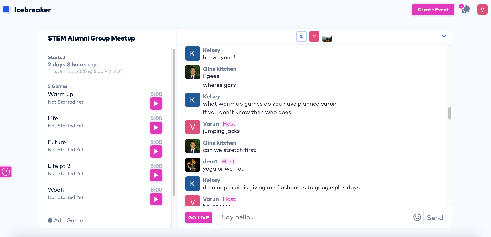
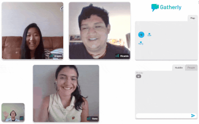

Zoom is a great platform. It handled the incredible increase in usage due to covid [fairly well](https://www.bloomberg.com/opinion/articles/2020-04-06/zoom-messed-up-amid-coronavirus-user-boom-but-it-s-no-villain) given that it instantly turned from a work platform to the default way that anyone communicates with those outside of their own house.

However, one thing is for sure. Zoom is not meant for social gatherings. 

Social gatherings are fundamentally different than how zoom portrays them. I know at social gatherings, I very rarely speak to more than 4 people at a time. I bounce around from person to person, catching up with each of them individually. Why is that? It is easier to involve everyone in a single stream of conversation when you have fewer people in the group. It gets increasingly difficult to involve everyone as the number of people in the group increases.

In fact, as the number of people in a zoom call increase, the host becomes hard pressed to involve everyone. I have personally experienced this. It makes me sweat to think about entertaining 9+ people at once on a zoom call. Since there is only one stream of conversation, the responsibility usually falls on the host to entertain everyone. Many times, I've noticed that people simply mute themselves and tune out. 

Why is it so hard to involve everyone? My hypothesis is that when there are many people, everyone is less willing to share their opinions because they are not as comfortable with everyone in the zoom call. I know I am a lot less open with 9+ people in a zoom call than if I am one-on-one with someone. Since everyone is much less open, conversation ends up being much more superficial. Eventually everyone runs out of superficial things to talk about and conversation dies out.

# How to fix this

With less than 9 people, zoom is generally completely fine. It provides a place for people to simply chat. With any more people, one stream of conversation is not enough. 

## Icebreaker

There are a few options that I have been experimenting with. I was recently introduced to [Icebreaker](https://icebreaker.video/) by David Kobrosky. It is an amazing platform to meet new people. Everyone is in a large chat room, and you have 'games' that the host can initiate. When the game starts, you get randomly paired with one other person in the group with whom you get to have a one-on-one video call. There are pre-made prompts on the side for you to talk about. 

*Screenshot of the meetup I hosted with the [STEM Alumni Community](https://stemalumnicommunity.netlify.app/)*

This is an awesome concept and it solves the problem of having surface level conversations due to too many people. However, it doesn't seem like the best platform for people you already know. I tried it with some friends in the [STEM Alumni Community](https://stemalumnicommunity.netlify.app/) that I run, and not everyone was a huge fan of it. A lot of people were turned off by the idea of an "icebreaker" for people who already knew each other. We ended up going to a zoom call with too many people and conversation died. 

The only fix for this in a zoom call is to play a game. With a game, everyone naturally becomes involved and having 9+ people together in a zoom call is extremely enjoyable. I plan to try that with this community. 

## Gatherly

The other way to have a social gathering online is a startup in our CREATE-X startup accelerator batch called [Gatherly](https://gatherly.io/). They are an awesome platform where you are a dot on a map and you can move around on the map. When you get close to someone on the map, you are instantly put in a video call with them. Multiple people can join each video call "huddle," and you can easily move around on the map to different video call huddles. This perfectly mimics social gatherings. 

The only downside I found was when everyone happens to get into the same video call, it is hard to branch off and start having side conversations again. In the real world, you can stealthily peel off. 

All in all, [Gatherly](https://gatherly.io/) is definitely my favorite platform for social gatherings so far. I'm looking forward to using it more.