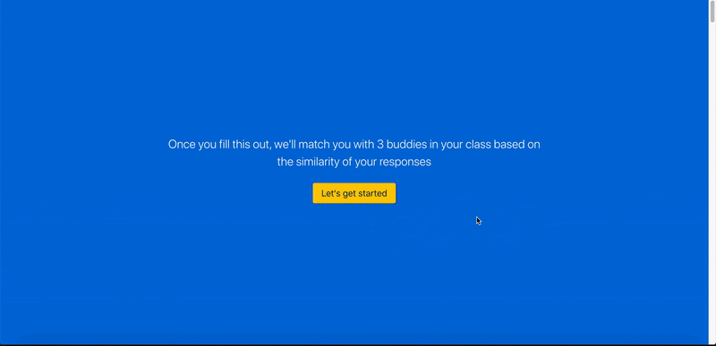
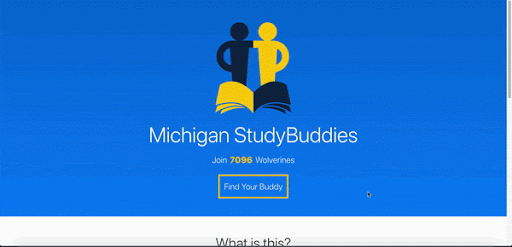
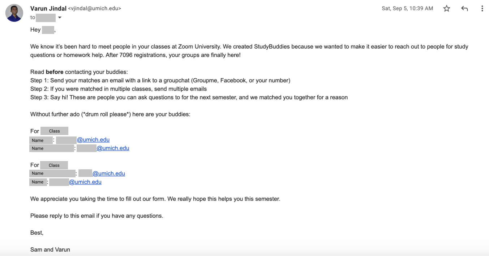
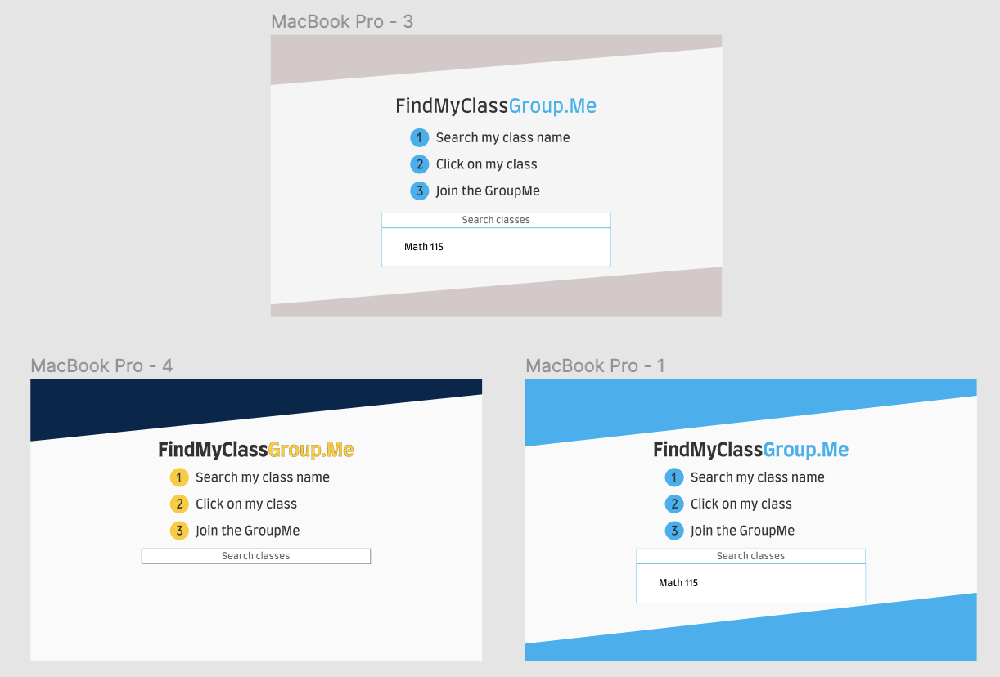
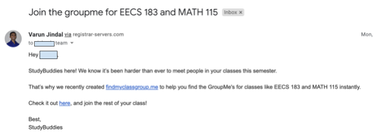
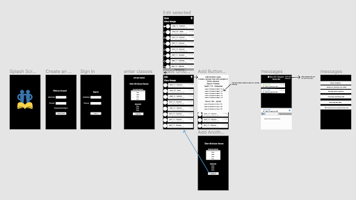
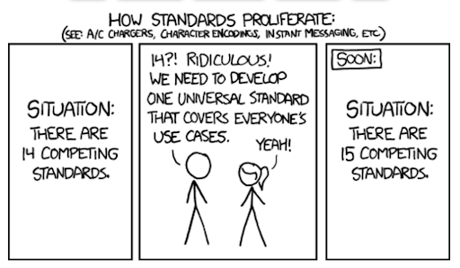

At the beginning of this year, Sam Forman and I understood that this semester would be tough at the University of Michigan. We had the experience of online school for the second half of the previous semester and there were plenty of challenges. The hardest part was the reduced collaboration in our classes. 

So, we decided to create a way to match people as StudyBuddies for the semester. We thought we would set up a form for people to sign up and then we would algorithmically match them with others in their class.

It turns out that making the perfect UX for that is actually really hard. 

## Branding

One of our first steps was branding. What did we want this to feel like? We wanted it to feel like a University of Michigan initiative to give it as much trust as possible. Colors were one of the toughest parts to decide on. Even after deciding on the shape and the 2-3 colors we wanted, getting the right permutation was very tough. For everyone we showed it to, we asked them a single question: which logo feels the most trustworthy?

At first we picked the logo second from the top left, but later we switched to the second from the bottom left. 

## The Form

While figuring out branding, we began developing the form. We wanted it to be extremely easy and have less friction than Google Forms. We thought Typeform had the best UX, so we created our own custom version, giving us more control over the buttons and the functionality. 

We were super happy with the final product because it looked and felt great on both desktop and mobile. You could either press enter or press the button to continue, allowing it to feel most natural for any user.

## The Launch

This was the first iteration of our website.

As it was, we received over 7000 form responses for this product even though there was quite a bit of text on this page. We managed to match everyone and send out buddies to everyone. Here's where we made our first major UX mistake. We sent out buddies by giving everyone the emails of everyone else. This was a ton of friction because users had to reach out via email to their buddies. We found out that about 51% of users did not make any interaction with their buddies. However, we were super happy that over 12% of users met on over 5 separate occasions. This meant that they likely were in touch the entire semester. However, it's obvious that there was significant friction in this approach. 

So for our next launch at UCLA and UChicago we wanted to improve on a few things. First off, the landing page had way too much text. We wanted to improve that. So, we created a prototype with much less text.

[https://www.figma.com/proto/Msf3z4c0q1rgykS1bBk2tE/UChicago-StudyBuddies?node-id=1%3A2&scaling=min-zoom](https://www.figma.com/proto/Msf3z4c0q1rgykS1bBk2tE/UChicago-StudyBuddies?node-id=1%3A2&scaling=min-zoom)

With this launch, we included people's phone numbers rather than their emails to hopefully make it less friction. We have yet to get data, but at both schools we ended up with around 10-25% of the student body signing up (similar to our launch at UMich). 

## DP 2

After all of this, we began to understand that very helpful interactions occurred in the group chats that are created for classes. However, we saw that in one of our classes, out of the ~900 people in the class, only 180 were in the group chat. Since these group chats were only distributed by word of mouth, there was no way for those who were unconnected to join. 

We realized there was no centralized repository of group chat links. So that's what we created (enter DP 2).

We weren't entirely sure that we wanted to affiliate this product with StudyBuddies, so we decided to brand it like GroupMe (the group chat app of choice for most UMich students).

So, we picked the bottom right design as the winner. It definitely still needed some cleaning up, which we ended up doing in the final prototype. 

A big reason why we wanted to build this was to test whether people had trouble finding the GroupMe links for their classes or whether the people who wanted to be in the group chat were already in it. 

We set up the site so that we could track all the metrics of which classes were clicked the most and how many GroupMe's were joined. 

Success for us would mean that over 200 people actually joined a GroupMe. We arrived at that number mostly through gut instinct and the fact that we wanted to define a success metric. 

After analyzing the ontology of the users from a previous project we had created and the current users we had, we understood that we could send out targeted emails like so:

This helped us get over 80 concurrent users at some point and over 800 total users when we launched. 

We ended up getting 351 join clicks! 

## Looking Forward

Our hypothesis was confirmed. Now we wanted to solve this confirmed problem. Our first idea was a messaging app where you could join any class group chat based on the classes you are in. 

This was a super low fidelity mockup we made for that.

However, we began to talk to more students and realized that most people are overwhelmed with the number of apps currently available for students. It's hard to keep track of them. It was the classic case of this comic:

If we made another messaging app, there would just be another app to check, which would not really help the problem. So, we plan to make a bot for GroupMe which can provide all the value for students from matching students to helping them remember assignments and more. 
