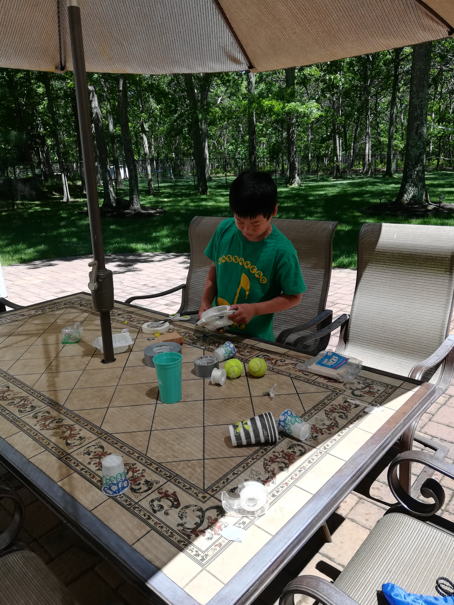
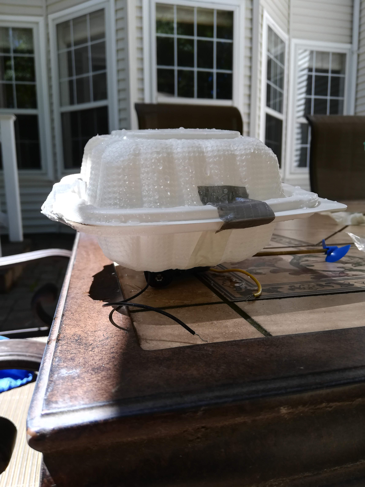

Ding! The doorbell rang clearly through the house and I rushed from my backyard to get the front door. It was 11:02 am, and I opened the door to Eric and Charles' bright faces. They had a huge bucket in their arms. I smiled and took one end of the bucket. We stepped off the porch into the bright summer sun, and carried it together to the backyard. 

As we walked around the house, the bright green of the grass expanded into a large fenced in area. The light breeze rustled the leaves above our heads. On the patio was a tiled table that had a large umbrella coming out from the middle to shield us from the sun. Strewn across the table were all sorts of household materials — plastic take-out containers, duct tape, styrofoam, scissors, tennis balls, and more. I talked to Eric and Charles about their school week. They are in 5th and 2nd grade respectively. Then I explained the challenge. 

"Alright, with the materials in front of you, build a boat that floats. The challenge is that you must have a way to attach this electric propellor." I motioned to the motor and battery contraption I had built on the table. "It must be removable."

"Woah, this is cool." Eric surveyed the materials.

I felt a small surge of pride. The boys instantly got busy building, and I took out the hose to fill up the bucket. While I was taking out the hose, I turned it on jet and sent a small stream of water just to the side of the table where the boys were building. Both of them looked up and grinned. 

About 4 minutes later, the water had covered the bottom of the bucket with just around an inch of water. Charles ran up to me and asked if he could test his first boat. With a surprised smile on my face, I happily agreed. I had never told them that prototyping and testing was the best way to create, but they had already begun the process — and fast! 

Eric ended up with a successful (and speedy) boat in 30 minutes

<iframe width="560" height="315" src="https://www.youtube.com/embed/caq0kS3Sxwk" frameborder="0" allow="accelerometer; autoplay; encrypted-media; gyroscope; picture-in-picture" allowfullscreen></iframe>

After that, Charles picked up the hose and began spraying himself with mist. Eric soon joined for what turned into a full fledged water war. Since Charles hadn't finished trying the motor on his boat, I was tempted to stop them, but I decided it was more fun if I didn't. They laughed, played and battled. With around 10 minutes left in the hour, the two of them were absolutely soaked and grinning from ear to ear. 

Then, something unexpected happened. The two of them picked up their boats and continued working on them. Charles managed to perfect his creation and attach the motor to it. 

<iframe width="560" height="315" src="https://www.youtube.com/embed/hrF-fg4fwDE" frameborder="0" allow="accelerometer; autoplay; encrypted-media; gyroscope; picture-in-picture" allowfullscreen></iframe>

Charles relished demolishing his creation with the hose soon after. Even 10 minutes after cleaning-up, they didn't want to leave. Only when the loud lawnmowers came, they returned to their house. I gave them the motor-propellor contraption to keep. 

I grabbed all the stuff and walked back into my house with a smile on my face. 

At around 6 pm, I received a stream of texts from their mom. I looked at my phone to see videos of many more boats that Eric and Charles had made throughout the day. They had found another propeller and even started racing their boats. I ran to each and every one of my family members to show them, pointing and gesturing with gusto as I explained what we had done during class. 

<iframe width="560" height="315" src="https://www.youtube.com/embed/TIRewlWBdGs" frameborder="0" allow="accelerometer; autoplay; encrypted-media; gyroscope; picture-in-picture" allowfullscreen></iframe>

I had found something that they really liked. That has been my goal with teaching them; I want to inspire them with the drive to create and learn. I am lucky that I have the freedom to teach them whatever I want. 

I am glad that I didn't stop them from playing and soaking each other. Maybe they only used half the class to build the boats, but the memories associated with building the boats were extremely positive. My hypothesis is that when positive experiences are associated with building, you are more motivated to build regardless of what those positive experiences were. Building should never seem like work at a young age, it should just be playing.

# The Gallery

<iframe width="560" height="315" src="https://www.youtube.com/embed/JLaLWatfOWc" frameborder="0" allow="accelerometer; autoplay; encrypted-media; gyroscope; picture-in-picture" allowfullscreen></iframe>

<iframe width="560" height="315" src="https://www.youtube.com/embed/8u4I8ggern4" frameborder="0" allow="accelerometer; autoplay; encrypted-media; gyroscope; picture-in-picture" allowfullscreen></iframe>