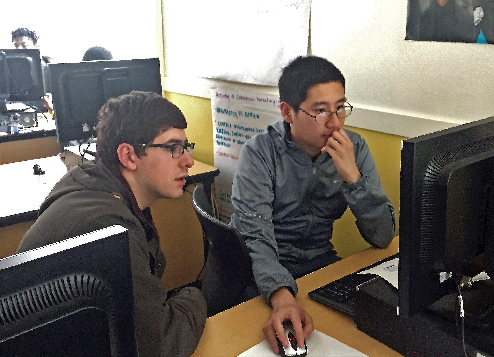

*[Source]([https://www.educationandcareernews.com/stem-education/5-reasons-students-should-learn-to-code/](https://www.educationandcareernews.com/stem-education/5-reasons-students-should-learn-to-code/))*

Over the past couple weeks working on [Enlight](enlight.nyc), each of us on the team ([Samay](https://shamdasani.org), [Maxim](https://maximgeller.com/), and I), have interviewed ~10 people about their coding journeys. 

One common thread among most people that I have talked to is that everyone had a buddy. The people that remained successfully motivated had someone to reach out to when they got really stuck. 

For me, that person was [Samay](https://shamdasani.org). He is one of my best friends from Michigan, and when I get stuck — I know I can go to him for help. 

For some, they have a person that they text/whatsapp/call, whether its for direct help or just for a keyword to google. Some have groups that they have formed to talk about their doubts and questions. But everyone who has kept with coding seems to have that person they can go to for help. 

# Buddies

Does this imply that coding is inherently frustrating so anyone learning needs support? Or is this indicative of a larger learning trend in humans where a person remains most motivated with someone to help them?

*[Source]([https://www.spokesman.com/stories/2017/may/31/the-beta-coders-club-seeks-to-promote-diversity-in/](https://www.spokesman.com/stories/2017/may/31/the-beta-coders-club-seeks-to-promote-diversity-in/))*

I believe it is the latter. It is demotivating when you get frustrated, and with anything that is hard, you are bound to get frustrated. It is extremely comforting to know that whenever you are stuck, there is someone to struggle with you. 

For this reason, a goal of ours for Enlight will be to create a community in which people can find their buddy.