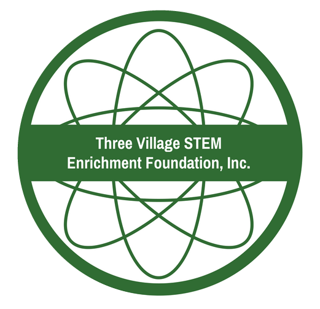
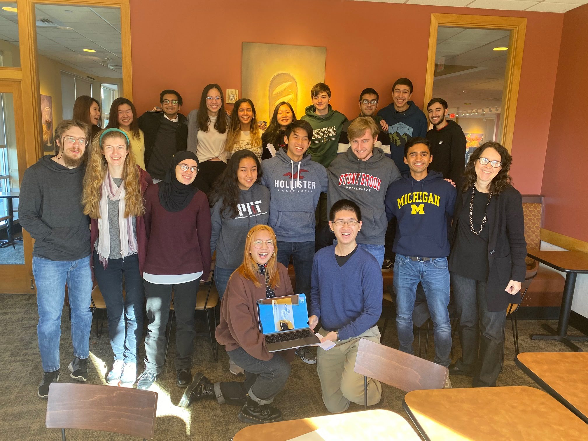
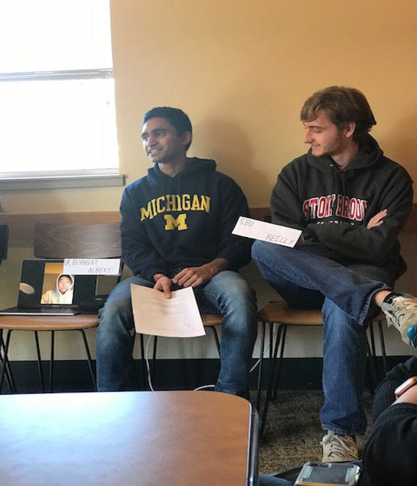

In my senior year of high school I was on the board of the [Three Village STEM Foundation](https://www.facebook.com/TVSTEM/). This board was created to promote enrichment in all STEM fields throughout the Three Village District. Cathy Masrour has been an incredible leader, with many amazing initiatives like introducing a STEM day at our high school and running summer enrichment camps on topics like 3D printing, chemistry, and robotics. 

I volunteered to assist in the [robotics summer camp](https://www.facebook.com/1157154970991809/videos/2301600159880612) my senior summer. At the camp, Ms. Masrour approached me with the idea of starting a STEM Alumni group. In the future, if someone wanted a way to contact any of the alumni in fields they were interested in, there should be a way. I thought it was an amazing idea. So, I started recruiting people to join.

Many of the people who joined ended up being my close friends. This was really fun because hanging out was something everyone wanted to do anyways. After many of us went to college for the first time, I understood the value that we could provide for seniors in high school. So, over Thanksgiving break when everyone was home, I decided to host an Alumni panel with the help of Ms. Masrour. 

*The panel is in the front row. The attendees are in the back row.*

This was incredibly fun. Ms. Masrour managed to secure a room at Panera Bread, and I prepared a panel discussion. Not only did I get to see many of my close friends again, we also were able to answer many questions about what college is like and settle concerns about the applications. 

When I was applying to schools, I was fortunate to have an older sister who had already gone through the process. I understood the majority of what was going on and still had questions about the process. I can only imagine how much more stressful it is for those like my sister who don't have someone to tell them how things go. 

The hardest decision I had to make was when deciding between colleges. I was extremely privileged to have a decision between 3 incredible schools: University of Michigan, UC Berkeley, and University of Illinois Urbana-Champaign. However, this also made the decision quite difficult. 

The only way for me to truly understand the small differences between each school was by talking to people. I managed to find connections at each of the schools to talk to, but it required many texts and calls. Additionally, it was hard to understand how to weigh each of the perspectives because it is from the view of a person who may have grown up in very different circumstances. Their experiences could have been entirely different from mine. On top of that, people at a college will almost invariably like the college. So I had to understand how to take out the bias as well.

All in all, it would have been nice to look at a list of people who were invested in my own success and have the ability to reach out to any of them. They would have a better understanding of where I am coming from and be able to provide more relevant feedback about the colleges. I would love to be that resource for people. I love talking about my college, and I know many people do too because I and many others get so much value from our colleges. 

Finally, an alumni group would be extremely useful for the graduating seniors in the future as well. Some of the most intelligent people I know are in the group, and I am so lucky to call them my friends. When the same high school graduates are looking for jobs in the future, they can reach out to us who may already have a job in a similar area and would be able to connect them to the right people. 

For me, the alumni group is also a large friend group. I hope that it helps us keep in touch over the years. The people I met at Ward Melville are truly special, I look forward to growing this group.